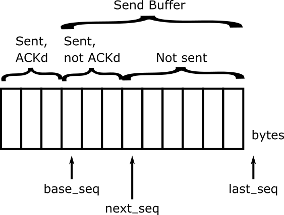
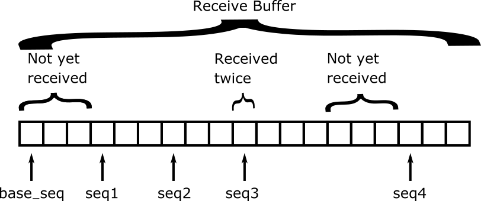
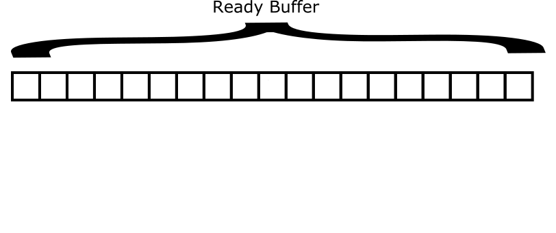

# TCP Lab

The objective of this assignment is to give you hands-on experience with TCP.
You will implement much of TCP, such that bytes are sent reliably in-order
between TCP sockets connected over a TCP connection.

# Table of Contents

 - [Getting Started](#getting-started)
   - [Update Cougarnet](#update-cougarnet)
   - [Resources Provided](#resources-provided)
   - [Topology](#topology)
 - [Part 1 - TCP Send Buffer](#part-1---tcp-send-buffer)
   - [Instructions](#instructions)
   - [Testing](#testing)
 - [Part 2 - TCP Receive Buffer](#part-2---tcp-receive-buffer)
   - [Instructions](#instructions-1)
   - [Testing](#testing-1)
 - [Part 3 - TBD](#part-3)
 - [Part 4 - TBD](#part-4)
 - [General Helps](#general-helps)
 - [Submission](#submission)


# Getting Started

## Update Cougarnet

Make sure you have the most up-to-date version of Cougarnet installed by
running the following in your `cougarnet` directory:

```bash
$ git pull
$ python3 setup.py build
$ sudo python3 setup.py install
```

Remember that you can always get the most up-to-date documentation for
Cougarnet [here](https://github.com/cdeccio/cougarnet/blob/main/README.md).


## Resources Provided

The files given to you for this lab are the following:
 - `buffer.py` - a file containing a stub implementation of a TCP send and
   receive buffer.  This is where you will do your work.
 - `test_buffer.py` - a file containing unit tests, which will be used to test
   your TCP buffer implementations.  You will also do your work here!
 - `mysocket.py` - a file containing a stub code for a TCP socket.  You will
   also do your work here!
   [network configuration files](https://github.com/cdeccio/cougarnet/blob/main/README.md#network-configuration-file)
   for testing your implementation.
 - `scenario1.py` - a scripts that tests the functionality of your reliable
   transport implementation.


## Topology


# Part 1 - TCP Send Buffer

In this part of the lab, you will write the code which is used by the TCP peer
to buffer bytes that are intended to be reliably sent, i.e., when
`TCPSocket.send()` is called by an application.

The following image illustrates the role of the send buffer from the
perspective of the `TCPSocket` class.


The `TCPSocket` class implements the sliding window for reliable delivery, with
the help of a `TCPSendBuffer` instance.  However, the `TCPSendBuffer` class
doesn't know anything about the size of the window (which will change over
time); it simply keeps track of:

 - all bytes that need to be sent; and
 - which of those bytes have been sent, but not acknowledged

Both of these are dictated by the `TCPSocket` instance using methods that will
be shown hereafter.  The perspective of the `TCPSendBuffer` is shown in the
following diagram:



Note that in both images the bytes labeled "Sent, ACK'd" are technically not
part of the buffer because nothing more needs to be done with them!  They are
simply shown for continuity.

You can think of the entire buffer as a stream of bytes.  Thus, there is a
sequence number associated with each byte in the buffer.  The three most
important numbers to keep track of are:

 - `base_seq` - the sequence number of the first unacknowledged byte in the
   window.
 - `next_seq` - the sequence number of the first yet-to-be-sent byte in the
   window.
 - `last_seq` - the sequence number of the byte _after_ the last byte in the
   buffer.

These are what help the buffer identify its current state, including the
locations of the "divisions" that are labeled in the above diagram.  For
example:

 - when `base_seq = next_seq`, then there are no bytes waiting to be
   acknowledged;
 - when `next_seq = last_seq`, there are no bytes in the buffer that haven't
   been sent; and
 - when `base_seq < next_seq < last_seq`, there is at least one byte that has
   been sent but not acknowledged, and at least one byte that has not been sent
   at all.

Note again that there is nothing for the buffer to know where the boundary of
the window is.   Thus, in the last case, the buffer does not actually know
whether or not the bytes(s) could be sent.  _That_ is the job if the
`TCPSocket` class.  Interfacing with the buffer is therefore a largely a matter
of calling methods like `put()`, `get()`, `slide()`, and `get_for_resend()`,
which are explained subsequently.


## Instructions

In the file `buffer.py`, flesh out the following methods for the
`TCPSendBuffer` class.

 - `put()` - This method takes the following as an argument:

   - `data`: raw bytes (`bytes`) to be send across a TCP connection.

   With this method data is added to the buffer.  This is called by
   `TCPSocket.send()`, such that all bytes are initially buffered and only sent
   if/when there is room in the window.

   For example, suppose the following are the values associated with a
   `TCPSendBuffer` instance:

   ```python
   buffer = b'abcdefg'
   last_seq = 1064
   ```
   
   When `put(b'hijk')` is called, then those would be changed to the following:

   ```python
   buffer = b'abcdefghijk'
   last_seq = 1068
   ```

 - `get()` - This method takes the following as an argument:

   - `size`: the number of bytes (`int`), at most, to be retrieved from the
     buffer.

   This method retrieves (at most) the next `size` bytes of data that have not
   yet been sent, so they can be sent using `send_packet()`.  It returns a
   tuple of `(bytes, int)`, where the first element is the bytes themselves and
   the second is the starting sequence number.  Typically `size` is max segment
   size (MSS).  If `size` exceeds the amount of data in the buffer, then only
   the remaining bytes are returned.

   This method is typically called in two cases: (1) when data is sent by the
   application to the socket (i.e., with `TCPSocket.send()`), and the window
   size allows for at least some of those bytes to be sent immediately; or (2)
   when an acknowledgment for new data is received, such that the window can be
   slid and more bytes sent.

   For example, suppose the following are the values associated with a
   `TCPSendBuffer` instance:

   ```python
   buffer = b'abcdefghijk'
   base_seq = 1057
   next_seq = 1061
   ```
   
   When `get(4)` is called, then those would be changed to the following:

   ```python
   buffer = b'abcdefghijk' # unchanged
   base_seq = 1057 
   next_seq = 1065 
   ```

   And the data returned would be: `(b'efgh', 1061)`


 - `data_to_resend()` - This method takes the following as an argument:

   - `size`: the number of bytes (`int`), at most, to be retrieved from the
     buffer.

   This method retrieves the next `size` bytes of data that have previously
   been sent but not yet acknowledged.  Typically `size` is MSS.  If `size`
   exceeds the amount of data in the buffer, then only the remaining bytes are
   returned.

   This is typically called after a loss event, such as timeout or
   triple-duplcate ACK.

   Note that this method is very much like `get()`, with the major difference
   being the _starting_ place of the bytes to be returned.

   For example, suppose the following are the values associated with a
   `TCPSendBuffer` instance:

   ```python
   buffer = b'abcdefghijk'
   base_seq = 1057
   next_seq = 1061
   ```
   
   When `get_for_resend(4)` is called, then those would be changed to the following:

   ```python
   buffer = b'abcdefghijk' # unchanged
   base_seq = 1057 
   next_seq = 1065 
   ```

   And the data returned would be: `(b'abcd', 1057)`

 - `slide()` - This method takes the following as an argument:

   - `seq`: the sequence number returned in the acknowledgment field of a TCP
     packet, i.e., acknowledging all bytes previous to that sequence number.

   This method acknowledges bytes from the buffer that have previously been
   sent but not acknowledged, opening the door for more bytes to be sent.  For
   example, suppose the following are the values associated with
   `TCPSendBuffer` instance:

   ```python
   buffer = b'abcdefghijk'
   base_seq = 1057
   ```
   
   When `slide(1061)` is called, then those would be changed to the following:

   ```python
   buffer = b'efghijk'
   base_seq = 1061
   ```
   
Also flesh out the following utility methods:

 - `bytes_not_yet_sent()` - return an `int` representing the number of
   bytes not-yet-sent in the buffer.


 - `bytes_outstanding()` - return an `int` representing the number of
   bytes sent but not yet acknowledged.


## Testing

The file `test_buffer.py` contains a suite of tests that use python's
[unittest module](https://docs.python.org/3/library/unittest.html) to
demonstrate the usage and test the functionality of `TCPSendBuffer`.
Run the following to test your buffer implementation (Note that this will also
test the functionality of the `TCPReceiveBuffer` class, which you will
implement in Part 2.  Thus, you will likely get failures for test related to
`TCPReceiveBuffer` at this point).

```bash
python3 test_buffer.py
```

or, alternatively:

```bash
python3 -m unittest test_buffer.py
```


# Part 2 - TCP Receive Buffer

In this part of the lab, you will write the code which is used by the TCP peer
to buffer bytes that have been received until they represent a continuous set
of in-order bytes, suitable for an application to call `TCPSocket.recv()`.

The following image illustrates the problem faced by receive buffer from the
perspective of the `TCPSocket` class.


It receives different segments of data, possible overlapping, possibly out of
order, and possibly with holes in between.  Each segment has a starting
sequence number (i.e., from the `seq` field of the TCP header accompanying the
segment) and a length. In the above example, segments `c1`, `c3`, `c2`, and
`c4` are received in that order, and they begin with sequence numbers `seq1`,
`seq3`, `seq2`, and `seq4`, respectively.  Segments `c1` and `c4` have length
3, and segments `c2` and `c3` have length 4.  Using their  sequence number and
length, these segments can be stitched together, with duplicate bytes removed,
once all the bytes have been received.  For example, a byte-level
representation of the receive buffer illustrated above is shown below:



A few things to note in this particular example:
 - The first three bytes (i.e., starting with `base_seq`) have not yet been
   received.
 - Segment `c3` was received before segment `c2`, even though `seq2` comes
   before `seq3`.
 - Segments `c2` and `c3` overlap by one byte, i.e., the byte at `seq3` has
   been received twice.
 - The three bytes immediately before `seq4` have not yet been received.

As a result:
 - Segment `c2` must eventually be put before segment `c3`, even though it
   arrived first.
 - As soon as the segment(s) containing the first three bytes are received,
   filling the hole at the beginning, the series of bytes from `seq1` through
   up until the next set of missing bytes, i.e., those immediately preceding
   `seq4`.
 - The "duplicate" byte by which `c2` and `c3` overlap must be thrown out.

Once an in-order sequence of bytes is ready, it can be sent to the ready
buffer, which is simply a queue of bytes from which a `TCPSocket()` reads when
its `recv()` method is called.




## Instructions

In the file `buffer.py`, flesh out the following methods for the
`TCPReceiveBuffer` class.

 - `put()` - This method takes the following arguments:

   - `data`: raw bytes (`bytes`) that have been received in a TCP packet
   - `sequence`: the sequence number associated with the first byte of the data

   With this method data is added to the buffer.  This is called by
   `TCPSocket.handle_data()`, such that all segments are initially buffered and
   only made available to the ready buffer when there is data at `base_seq`
   (i.e., no "hole" at the beginning).  The suggested implementation is to map
   incoming segments of data by sequence number in a dictionary.
   
   For example, suppose a `TCPReceiveBuffer` instance, `buf` is initialized
   thus:

   ```python
   buf = TCPReceiveBuffer(2021)
   buf.put(b'def', 2024)
   buf.put(b'mn', 2033)
   ```

   The segments might be stored in a dictionary in the instance variable
   `buffer` with the following value:

   ```python
   {2024: b'def', 2033: b'mn'}
   ```
   
   The following rules should be applied when adding segments to the receive
   buffer:

   - If a segment is received, and the sum of its starting sequence number plus
     its length (i.e., the sequence number following this segment) is less than
     or equal to`base_seq`, then ignore it.  It is old data.

     For example, if `base_seq = 2021`, and a segment with sequence 2001 and
     length 4 is received, it is discarded.
   - If a segment is received, and its starting sequence number is less than
     `base_seq`, but its length makes it extend to `base_seq` or beyond, then
     trim the first bytes off, so that it starts with `base_seq` and is stored
     in the dictionary accordingly.

     For example, if `base_seq = 2021`, and data with sequence 2019 and length
     3 is received, the first two bytes of the segment are discarded, the
     remaining two bytes are given starting sequence 2021.
   - If a segment arrives with the same sequence number as another segment that
     has previously been received, keep only the segment that is the longest.
   - After every segment is added, iterate through each segment in the buffer,
     in order.  For each segment, consider the segment immediate preceding it.
     If the length of the preceding segment makes it extend to the sequence of
     the current segment or beyond, then trim the first bytes off of the
     current segment, so that its new sequence number corresponds to the first
     non-duplicate byte.  Use the updated sequence number to map the segment.
     Don't forget to delete the old reference to the segment!

     For example, if a segment exists in the buffer with sequence 2026 and
     length 4, and a new segment is received with sequence 2024 and length 3,
     then the reference to segment with sequence 2026 is removed, and it is
     replaced with the segment starting with sequence 2027 consisting of the
     last three bytes of what was previously segment with sequence 2026.

   Consider the following example:

   ```python
   buf = TCPReceiveBuffer(2021)
   buf.put(b'foo', 2001)
   buf.put(b'fghi', 2026)
   buf.put(b'def', 2024)
   buf.put(b'mn', 2033)
   ```

   This results in the following value of `buf.buffer`:

   ```python
   {2024: b'def', 2027: b'ghi', 2033: b'mn'})
   ```
   
 - `get()` - This method takes no arguments.  It retrieves the largest
   set of contiguous (i.e., no "holes") bytes that have been received, starting
   with `base_seq`, eliminating any duplicates along the way.  It updates
   `base_seq` to the sequence number of the next segment expected.  It returns a
   a tuple of `(bytes, int)`, where the first element is the bytes themselves
   and the second is the sequence number of the starting sequence of bytes.
   This method is typically called by `TCPSocket.handle_data()`, immediately
   after `put()` is called.  The idea is to check the buffer immediately after
   data has been received to see if any is ready to be put into the ready buffer.

   To build the string of bytes to be returned, start with the segment that
   starts with sequence `base_seq`, and append the data from each segment, in
   sequence order, until there is a gap in the bytes.  Then update `base_seq`,
   and return the sequence of bytes along with the previous value of `base_seq`.

   For example, consider the following example:

   ```python
   buf = TCPReceiveBuffer(2021)
   buf.put(b'fghi', 2026)
   buf.put(b'def', 2024)
   buf.put(b'mn', 2033)
   ```

   There are holes in the data starting at sequence numbers 2021 and 2030.
   Thus, calling `get()` with the buffer in this state would result in a return
   value of:

   ```
   (b'', 2021)
   ```

   Note that the sequence number returned should always be the value of
   `base_seq`, before it is incremented in the `get()` method.

   But when the following is called, the first hole is filled:
   
   ```python
   buf.put(b'abc', 2021)
   ```

   So now when `get()` is called again, the value returned is:

   ```
   (b'abcdefghi', 2021)
   ```

   At this point, the member values associated with
   the `TCPSendBuffer` instance are as follows:

   ```python
   base_seq = 2030
   buffer = {2033: b'mn'}
   ```
   

## Testing

The file `test_buffer.py` contains a suite of tests that use python's
[unittest module](https://docs.python.org/3/library/unittest.html) to
demonstrate the usage and test the functionality of `TCPReceiveBuffer`.
Run the following to test your buffer implementation:

```bash
python3 test_buffer.py
```

or, alternatively:

```bash
python3 -m unittest test_buffer.py
```


# Submission
